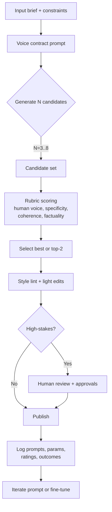

# How to Make AI Writing More Creative and Humanlike Without Sounding “Botty”

## Executive summary

This document focuses on **legitimate quality improvements**: making model outputs read as **more natural, specific, and voice-consistent** to humans, while reducing patterns many readers perceive as “AI-ish.” It does **not** recommend deceptive practices (for example, misrepresenting authorship in violation of policies, contracts, or academic rules). Research suggests both humans and automated detectors are imperfect at identifying AI text, so the most robust goal is **higher writing quality + transparent workflow controls**, not “beating detection.” citeturn16view0turn1search0turn1search3

Across the literature and official guidance, the biggest quality drivers cluster into four levers:

1. **Prompting and in-context examples** (few-shot, explicit voice constraints, clear success criteria). Few-shot learning is a core capability of large models; providing exemplars improves adherence to style and format. citeturn3search0turn10search18turn10search1  
2. **Decoding controls** (temperature/top-p/top-k, nucleus sampling). Nucleus sampling was introduced specifically to reduce “degenerate” generation while preserving diversity. citeturn0search0turn0search11turn10search13  
3. **Selection and refinement at inference time** (sample multiple candidates, then rerank; iterative self-feedback/refinement). Iterative refinement can improve human preference ratings without extra training. citeturn17search0turn3search2turn17search6  
4. **Training-time adaptation** when you need consistent voice at scale (SFT; preference tuning like DPO; parameter-efficient tuning like LoRA/QLoRA). These methods improve reliability of behavior and style beyond what fits in prompts. citeturn5search22turn2search2turn2search0turn2search1  

**Recommended default architecture (unspecified model family):** a pipeline that (a) uses a structured “voice + constraints” prompt, (b) generates 3–8 candidates with moderate creativity settings, (c) reranks with a rubric (“human voice,” specificity, coherence, factuality), (d) runs a lightweight style-lint pass, (e) performs optional human review for high-stakes content. citeturn17search0turn10search1turn10search24

Unspecified details (not provided by user) that materially affect recommended settings: **content domain** (marketing, fiction, support), **risk tolerance** (factuality requirements), **target reading level**, **brand voice constraints**, **latency/cost budget**, and **deployment channel** (API vs on-device).  

## Background on common AI “tells” and human writing markers

### What people perceive as “AI-ish” patterns

Research on open-ended generation repeatedly documents a cluster of artifacts that correlate with low-quality or machine-like text, especially under certain decoding strategies:

**Over-smoothness and genericness.** Models often default to safe, high-probability phrasing, producing “bland” continuations; this is closely tied to decoding/training dynamics and is discussed in work on degeneration and dullness. citeturn0search0turn12search0

**Repetition loops.** Both decoding-time effects and training objectives can yield repetitive phrases, sentence structures, and topic cycling. Unlikelihood training was proposed specifically because standard likelihood training can assign too much probability to repetitive sequences. citeturn12search0

**Template rhetoric.** Readers frequently flag patterns like: over-signposting (“In conclusion…”), symmetrical bulleting, and “balanced but empty” disclaimers. Human raters in experiments also associate “nonsensical” and “repetitive” features with AI outputs, even when they fail to reliably classify origin overall. citeturn16view0turn14search1

**Distributional oddities under naive sampling.** The nucleus sampling line of work frames an “unreliable tail” problem: pure sampling can produce incoherent or degenerate text, motivating truncation-based approaches like top-p. citeturn0search4turn0search12

**Stylometric regularities.** Multiple studies show that **stylometric features** (function words, POS patterns, punctuation distributions, etc.) can separate many LLM outputs from human writing in specific settings, even if humans themselves struggle. citeturn14search16turn14search0turn16view0

### Markers of human writing that models often underproduce by default

Human writing markers are not magic “tells.” They are tendencies that show up in stylometry and in human-evaluation frameworks: variation, coherence, relevance, and contextual appropriateness. citeturn14search25turn14search1

Common markers that increase perceived humanity (especially to readers, not detectors):

**Concrete situated detail.** Humans naturally anchor text in specific constraints (time, place, stakes, and trade-offs).  

**Uneven rhythm and intentional emphasis.** Sentence length and structure vary, sometimes for rhetorical effect, sometimes because humans revise locally. Stylometric analyses often leverage these variations. citeturn14search16turn14search0  

**Authorial intent and selective omission.** Humans choose what *not* to say; models often over-explain unless constrained. Prompt-level instruction and evaluation rubrics can directly push toward concision where appropriate. citeturn10search1turn14search1  

**Revision fingerprints.** Human text often reads like it has been edited: tightened openings, cut redundancies, clarified nouns, improved verb choices. Iterative refinement methods operationalize this idea for LLM outputs. citeturn17search0

### Examples of “tells” and fixes

Below are illustrative examples (not from the cited papers) to make the patterns concrete.

**Example A: generic signposting**

**Before (common pattern):**
> In today’s fast-paced world, it is important to note that effective communication is essential. In this article, we will explore several key strategies to improve communication.

**After (more human):**
> Most communication problems aren’t about vocabulary. They’re about timing, incentives, and what people are afraid to say out loud. Here are a few fixes that work in the real world.

**What changed:** removed filler (“today’s fast-paced world”), added a defensible point of view, and used concrete framing (“timing, incentives, fear”). These are consistent with evaluation guidance that “coherence” and “relevance” matter more than ornamental fluency. citeturn14search1turn14search25

**Example B: repetition and dullness**

**Before:**
> The product is very helpful and easy to use. It helps users solve problems quickly. It is designed to help users get results.

**After:**
> It’s built for the moment you’re stuck: one screen, the next step, and no hunting through menus. Most people get to a usable result in a couple minutes, not an afternoon.

**What changed:** eliminated repeated lemmas (“help”), added scenario specificity. Repetition and dullness are explicitly discussed as common generation failures in neural text generation research. citeturn12search0turn0search0

## Evidence-based techniques to improve creativity and human realism

This section maps the requested techniques to what research and official docs imply works reliably in practice.

### Prompt engineering and few-shot exemplars

**Why it works:** large models can learn task behavior from a handful of examples (“in-context learning”), demonstrated prominently in the GPT-3 few-shot learning results. citeturn3search0turn3search8

**What consistently improves humanlike writing quality:**
- **Explicit “voice contract”** (tone, persona boundaries, taboo phrases, pacing) placed in the highest-priority instruction channel available (for example, system/developer instructions depending on API). OpenAI’s prompt engineering guidance emphasizes instruction priority and using high-level instructions to control behavior. citeturn10search1turn14search3  
- **Few-shot “style anchors”**: 2–6 short exemplars paired with brief rationales (“why this is good”) often yields better style adherence than abstract descriptors alone. This aligns with guidance to provide examples of good output. citeturn10search18turn5search11  
- **Negative constraints** (“avoid these phrases,” “do not use listicles,” “no corporate filler”) combined with positive targets (“sound like X: crisp, opinionated, specific”).  

[Inference] If your goal is “more human to readers,” a strong heuristic is to anchor the output in **specific context** (stakes, constraints, sensory detail, trade-offs). This pushes the model away from “generic completion” mode and toward “situated drafting.”

### System messages and instruction hierarchy

Modern production systems often distinguish instruction roles (system vs developer vs user). OpenAI documentation explicitly notes that instructions can have different authority levels and higher-level instructions take priority over input prompts. citeturn10search1turn14search3

Implication for writing quality: put your **stable voice rules and taboo patterns** in the highest authority channel, and keep user prompts mostly factual and context-heavy.

### Temperature, top-p, top-k, and decoding strategy

**Core findings:**
- Nucleus (top-p) sampling was introduced to mitigate generation degeneration and improve overall generation quality under human evaluation compared to other decoding strategies. citeturn0search0turn0search12turn0search8  
- OpenAI’s API reference describes `top_p` as nucleus sampling and notes you generally adjust `temperature` or `top_p`, but not both. citeturn0search11turn5search13  
- In open-source `transformers`, generation parameters have documented defaults (for example, `top_k` default 50, `top_p` default 1.0, temperature default 1.0 when not set). citeturn10search13turn3search27  
- Greedy decoding is a baseline that can become repetitive for longer outputs; Hugging Face guidance flags this explicitly. citeturn10search24  

**Practical interpretation:**
- For **creative writing**, you generally want *some* stochasticity (sampling) plus controls against tail weirdness (top-p and/or top-k).  
- For **brand writing**, you often want moderate creativity but very consistent tone; this favors **moderate temperature** plus **reranking** (see below) instead of extreme sampling settings.  

### Chain-of-thought control and reasoning visibility

Chain-of-thought prompting can improve reasoning performance on complex tasks. citeturn0search1turn0search17  
Self-consistency (sampling multiple reasoning paths and selecting the most consistent answer) improves performance further in reasoning benchmarks. citeturn3search2

For **creative writing**, the practical use is usually not “show your chain-of-thought,” but:
- Ask the model for a **short outline/beat sheet** first (or generate it internally), then write the final prose.
- Keep the final output free of meta-reasoning unless the application wants it.

### Style transfer and controllable generation

Control can be introduced either at inference time or via training:

- **Control codes**: CTRL trains on control codes to govern style/content/task behavior. citeturn4search1turn4search9  
- **Plug-and-play control**: PPLM steers generation using lightweight attribute models without retraining the base LM, enabling topic/sentiment steering. citeturn4search0turn4search32  
- **Classic neural style transfer**: cross-alignment methods do style transfer from non-parallel text. This is useful background, though modern LLM practice more often uses instruction conditioning or fine-tuning instead. citeturn4search2turn4search18  

### Fine-tuning, RLHF, DPO, and data augmentation

**Training-time methods** are most justified when you need high volume and consistent voice, or when prompt-only steering is too expensive in tokens/latency.

- **RLHF-style alignment** (InstructGPT) shows that fine-tuning with human feedback can produce models preferred by humans over much larger base models. citeturn0search2turn0search22  
- **DPO** is a simpler preference-optimization approach that avoids explicit reward modeling and RL loops; it is widely used as an RLHF alternative. citeturn2search2turn5search19  
- **LoRA** reduces the number of trainable parameters by injecting low-rank adapters while freezing base weights. citeturn2search0turn15search25  
- **QLoRA** extends this with 4-bit quantization to enable fine-tuning very large models with significantly lower memory. citeturn2search1  
- **OpenAI SFT guidance** and best practices emphasize embedding the instructions/prompts that worked pre-fine-tune into every training example for generalization. citeturn5search11turn5search22  

Data augmentation (for training style/voice or robustness):
- Back-translation is a classic method for leveraging monolingual data (originating in NMT literature). citeturn13search4turn13search0  
- Simple text augmentation operations (EDA) can help in small-data settings. citeturn13search1turn13search5  
- Surveys caution that augmentation impacts meaning vs form and should be used intentionally. citeturn13search30  

### Post-processing heuristics

There is a clear research distinction between:
- **Training/decoding fixes** for repetition and degeneration (nucleus sampling, unlikelihood training). citeturn0search0turn12search0  
- **Editorial post-processing** for style consistency and readability (linting, rewriting, human review), which is best seen as a product workflow aligned with human evaluation best practices. citeturn14search1turn17search0  

[Inference] Post-processing is most valuable when it is framed as **quality control** (remove redundancy, enforce house style, ensure the piece contains concrete details) rather than as “concealment.”

## Practical implementation recipes and code snippets

### Reference workflow



This “generate → select → refine → review” structure aligns with evidence that iterative refinement and selection strategies can materially improve perceived quality. citeturn17search0turn17search6turn14search1

### Prompt template: voice contract + constraints

Below is a general template you can adapt across providers. (Names like “system”/“developer” vary by API.)

```text
[HIGH-PRIORITY INSTRUCTIONS / SYSTEM OR DEVELOPER]

You are a writing assistant producing human-centered prose.

Voice contract:
- Tone: confident, practical, occasionally opinionated.
- Rhythm: varied sentence length; avoid repetitive openers.
- Specificity: include concrete details (numbers, scenarios, constraints) when available.
- Avoid: generic filler (e.g., "in today's world", "it's important to note", "in conclusion"),
  and avoid overusing bullet lists.
- No self-referential AI language (e.g., "as an AI language model") unless explicitly requested.

Output requirements:
- Format: [Markdown | plain text | JSON field final_text] (UNSPECIFIED by user; choose per app)
- Length: [target words or sections]
- Must respect: safety policies, privacy, and any provided brand rules.

Process:
1) Draft.
2) Self-edit once: remove filler, increase concreteness, tighten verbs.
3) Return only the final text unless a separate "notes" field is requested.
```

Why this works: it encodes a stable instruction set with explicit positive/negative constraints, consistent with official guidance on using high-level instructions and examples to control behavior. citeturn10search1turn10search18

### Few-shot style anchoring

Few-shot prompting is foundational for in-context learning. citeturn3search0turn3search12

Use **short exemplars** that match your target domain. Keep them small so they fit into context and remain easy to update.

```text
Example 1 (desired):
[Paste 120–200 words of ideal output]

Why it’s ideal:
- Uses concrete scenario + stakes
- Minimal filler
- Varies sentence length
- Ends with a crisp takeaway

Example 2 (desired):
[Paste another exemplar]
...
Now write the requested piece:
[Your actual task + context + facts]
```

### Recommended decoding configurations (LLM-agnostic)

The exact knobs differ by provider. These defaults are starting points, not universal truths.

| Use case | Sampling strategy | Suggested starting point | Notes |
|---|---|---|---|
| Short marketing copy | Moderate sampling + rerank | temperature ~0.6–0.9; top_p ~0.85–0.95 | Adjust temperature or top_p, not both, when possible. citeturn0search11turn5search13 |
| Creative fiction / ideation | Higher sampling + constraints | temperature ~0.9–1.2; top_p ~0.9–0.98; consider top_k cap in open-source | Nucleus sampling targets degeneration in open-ended generation. citeturn0search0turn0search12 |
| Long-form blog with factual claims | Lower sampling + citations/RAG | temperature ~0.2–0.6; top_p ~0.8–0.95; add retrieval | Greedy decoding can get repetitive in long outputs; avoid pure greedy. citeturn10search24turn0search11 |

Open-source defaults (if you do nothing) often include `top_k=50`, `top_p=1.0`, `temperature=1.0` in `transformers`, which is not always what you want for consistent brand prose. citeturn10search13turn3search27

### Code: OpenAI-style API call with structured outputs

If you need predictable application parsing (for example, `final_text`, `quality_flags`), structured outputs can enforce a JSON schema. citeturn5search2turn5search14

```python
from openai import OpenAI

client = OpenAI()

VOICE_CONTRACT = """
You are a writing assistant producing human-centered prose.

Voice contract:
- Tone: confident, practical, occasionally opinionated.
- Rhythm: varied sentence length; avoid repetitive openers.
- Specificity: include concrete details when available.
- Avoid generic filler and AI self-references unless explicitly requested.

Return:
- final_text: markdown string
- quality_flags: array of short strings describing any issues you noticed
"""

schema = {
    "type": "object",
    "properties": {
        "final_text": {"type": "string"},
        "quality_flags": {"type": "array", "items": {"type": "string"}}
    },
    "required": ["final_text", "quality_flags"],
    "additionalProperties": False
}

resp = client.responses.create(
    model="UNSPECIFIED_MODEL",
    instructions=VOICE_CONTRACT,
    input="Write a 250-word intro to a blog post about reducing meeting load. Target: managers.",
    response_format={
        "type": "json_schema",
        "json_schema": {"name": "writer_output", "schema": schema, "strict": True}
    },
    # Not all models expose all parameters; confirm per model/provider. citeturn0search11turn10search1
)

data = resp.output_parsed
print(data["final_text"])
print("Flags:", data["quality_flags"])
```

### Code: open-source generation with `transformers`

Hugging Face documents generation parameters and defaults; use them explicitly rather than relying on defaults. citeturn10search13turn10search24turn3search3

```python
from transformers import AutoTokenizer, AutoModelForCausalLM

model_name = "UNSPECIFIED_OPEN_SOURCE_MODEL"
tokenizer = AutoTokenizer.from_pretrained(model_name)
model = AutoModelForCausalLM.from_pretrained(model_name)

prompt = """You are a writing assistant...
[voice contract here]

Task: Write 2 short options for a punchy blog opening about meeting overload.
"""

inputs = tokenizer(prompt, return_tensors="pt")

out = model.generate(
    **inputs,
    do_sample=True,          # avoid greedy for longer creative outputs citeturn10search24
    temperature=0.8,
    top_p=0.9,               # nucleus sampling citeturn0search0turn10search13
    top_k=50,                # HF default if unspecified citeturn3search27turn10search13
    repetition_penalty=1.08, # light guard against loops
    max_new_tokens=220,
)

print(tokenizer.decode(out[0], skip_special_tokens=True))
```

### Code: serving open-source models via vLLM-style backends

vLLM is commonly used for high-throughput serving and exposes an OpenAI-compatible interface in many deployments, reducing integration friction. citeturn15search6turn15search2

[Inference] If latency is a constraint, consider a serving backend (like vLLM) + smaller model + best-of-N reranking, instead of one huge model call.

### Best-of-N sampling and reranking recipe

Research and practice increasingly rely on “generate multiple, then pick best” (best-of-N / reranking). citeturn17search6turn17search2

A lightweight implementation (model-agnostic):
1. Generate N candidates with moderate creativity.
2. Score each candidate with a rubric.
3. Select top-1 (or top-2 for optional human choice).

**Rubric dimensions (recommended):**
- Human voice match
- Specificity and concreteness
- Coherence and flow
- Non-repetition
- Factuality and appropriate uncertainty (if facts are involved)

This connects directly to human evaluation criteria like fluency, coherence, relevance, and factuality. citeturn14search5turn14search25

### Iterative self-refinement recipe

Self-Refine formalizes a loop where the model critiques a draft and then revises it, improving human preference outcomes without training. citeturn17search0turn17search12

```text
Step 1: Draft (fast, creative)
Step 2: Feedback (critic)
- List the 3 biggest "robotic" patterns: filler, repetition, generic claims
- List 3 concrete details that could be added if available
- Flag any unverifiable claims
Step 3: Revise (apply feedback)
- Keep meaning, improve voice and specificity
- Remove filler
- Tighten verbs
Return only the revised version.
```

### Post-processing filters: a “style lint” pass

A style-lint pass can catch visible “botty” artifacts before publishing. This is best treated as editorial QA, not as an attempt to bypass provenance systems. citeturn14search1turn1search3

```python
import re
from collections import Counter

BANNED_PHRASES = [
    r"\bas an ai language model\b",
    r"\bit is important to note\b",
    r"\bin conclusion\b",
    r"\btoday['’]s (fast[- ]paced )?world\b",
]

def sentence_starts(text: str, n: int = 12):
    # naive sentence split; replace with spaCy or nltk in production
    sents = re.split(r"(?<=[.!?])\s+", text.strip())
    starts = []
    for s in sents[:n]:
        words = re.findall(r"[A-Za-z']+", s.lower())
        if words:
            starts.append(words[0])
    return starts

def lint_human_voice(text: str) -> dict:
    flags = []

    lowered = text.lower()
    for pat in BANNED_PHRASES:
        if re.search(pat, lowered):
            flags.append(f"contains_banned_phrase:{pat}")

    starts = sentence_starts(text)
    if starts:
        most_common, count = Counter(starts).most_common(1)[0]
        if count >= 3:
            flags.append(f"repetitive_sentence_openers:{most_common}:{count}")

    # simple repetition heuristic: repeated trigrams
    tokens = re.findall(r"[A-Za-z']+", lowered)
    trigrams = zip(tokens, tokens[1:], tokens[2:])
    tri_counts = Counter(trigrams)
    rep_tris = [tri for tri, c in tri_counts.items() if c >= 2]
    if rep_tris:
        flags.append(f"repeated_trigrams:{len(rep_tris)}")

    return {"flags": flags}

# Example usage:
# result = lint_human_voice(draft_text)
# if result["flags"]: send back for revision with flags
```

## Evaluation metrics and human-in-the-loop testing protocols

### Automatic metrics that correlate with “humanlike” generation properties

No single metric fully captures creativity or human realism, so use a **bundle**:

- **MAUVE**: measures divergence between model text and human text distributions and reports correlation with human judgments in open-ended tasks in its original work. citeturn11search0turn11search32  
- **Diversity metrics**: Distinct-n is widely used but has known issues; Self-BLEU measures diversity by comparing generated samples to each other. citeturn12search2turn12search23turn12search7  
- **Repetition measures**: duplicate n-grams and repetition rates are commonly tracked; repetition is a known failure mode. citeturn12search0turn10search24  
- **Semantic similarity metrics** (when you have references): BERTScore and BLEURT better capture paraphrase/semantic similarity than pure n-gram overlap in many settings. citeturn11search1turn11search10turn11search6  
- **Human-vs-machine discrimination frameworks**: HUSE combines human and statistical evaluation and highlights that optimizing “quality” can reduce diversity. citeturn11search7turn11search15  

Practical guidance: use automatic metrics primarily for **regression testing** (detecting changes across model versions, prompts, or decoding settings), not as final truth. Human evaluation best-practice surveys emphasize variability and pitfalls in evaluation design. citeturn14search1turn14search13

### Human evaluation design that actually works

A best-practice review of human evaluation in NLG emphasizes standardizing tasks, instructions, and reporting to reduce inconsistency. citeturn14search1turn14search29

Recommended protocol (application-ready):

**Define evaluation axes (pick 3–6):**
- Fluency
- Coherence
- Relevance/usefulness
- Factuality (if applicable)
- Voice match / persona fit
- Originality (task-dependent) citeturn14search5turn14search25  

**Prefer pairwise comparisons over absolute scoring** when feasible. Pairwise setups can be more stable and can be made more annotation-efficient with active selection methods. citeturn14search2turn14search6  

**Measure inter-rater agreement** and adjudicate disagreements for high-stakes evaluation. Best-practice frameworks emphasize careful planning and review phases. citeturn14search1turn16view1  

### LLM-as-a-judge: when to use it and how to control risk

LLM-as-a-judge has become a scalable way to approximate human preferences in open-ended generation, but it carries biases (position bias, verbosity bias, self-enhancement) and needs calibration. citeturn17search21turn17search29turn17search37

A safe, robust setup:
- Use LLM-judging for **rapid iteration** (prompt tweaks, decoding sweeps).
- Periodically **ground-truth with humans** and measure judge-human agreement drift.
- Randomize candidate order and hide model identifiers to reduce judge bias. citeturn17search21turn17search29  

### Minimal evaluation dashboard (recommended)

Track these per content type:
- Win-rate in pairwise comparisons (new system vs baseline)
- Repetition rate
- “Filler phrase” incidence from style-lint
- MAUVE (if you have a human reference corpus)
- Human-rated voice match score
- Revision count (how often self-refine or humans must fix it)

This aligns with the general observation that NLG evaluation involves multiple criteria and that practices vary widely, so instrumenting your own consistent process matters. citeturn14search1turn14search25

## Trade-offs, recommended defaults, and configurable parameters

### Technique comparison table

Effectiveness is contextual; the table reflects typical outcomes reported in research and widely used practice patterns, not a single universal benchmark.

| Technique | Typical effectiveness | Complexity | Incremental cost | Key risks |
|---|---:|---:|---:|---|
| Prompt engineering + voice contract | High for style; medium for deep consistency | Low | Low | Prompt bloat; brittle across tasks citeturn10search1turn3search9 |
| Few-shot exemplars | High when style is clear | Low–Medium | Low | Overfits to examples; context length pressure citeturn3search0turn10search18 |
| Temperature/top-p tuning (nucleus sampling) | Medium–High | Low | Low | Too high: incoherence; too low: blandness citeturn0search0turn0search11 |
| Best-of-N + reranking | High | Medium | Medium–High | Reward hacking if scorer is gamed; latency citeturn17search6turn17search30 |
| Self-refine (iterative feedback) | Medium–High | Medium | Medium | Can “polish” wrong content; needs factual checks citeturn17search0turn14search25 |
| Style transfer steering (CTRL/PPLM) | Medium | High | Medium | Maintenance burden; attribute leakage citeturn4search0turn4search1 |
| SFT (fine-tuning on examples) | High for consistent voice | High | High | Data quality traps; overfitting; governance needs citeturn5search22turn10search5 |
| Preference tuning (DPO / RLHF family) | High for “what humans prefer” | Very High | Very High | Mis-specified preferences; high operational overhead citeturn2search2turn0search22turn15search33 |
| PEFT (LoRA/QLoRA) | High cost-efficiency | High | Medium | Adapter management; eval drift across base updates citeturn2search0turn2search1turn15search0 |
| Post-processing “style lint” | Medium (catches visible artifacts) | Low–Medium | Low | Over-filtering; can remove necessary disclosures citeturn14search1turn1search0 |

### Default parameter set (starting point)

These defaults are meant to be configurable. Adjust by domain and risk.

| Parameter | Default | Range | Rationale |
|---|---:|---:|---|
| N candidates | 5 | 3–12 | Enables reranking and variation without huge cost. citeturn17search6turn17search2 |
| temperature | 0.8 | 0.2–1.2 | Moderate creativity while staying coherent. citeturn0search11turn10search13 |
| top_p | 0.9 | 0.75–0.98 | Nucleus sampling reduces degeneration in open-ended text. citeturn0search0turn0search11 |
| top_k (open-source) | 0 or 50 | 0–200 | `transformers` default is 50 if unset; tune explicitly. citeturn3search27turn10search13 |
| repetition penalty (open-source) | 1.05 | 1.0–1.2 | Light guard against loops; repetition is common failure. citeturn12search0turn10search24 |
| self-refine iterations | 1 | 0–2 | One pass gives most of the polish benefit without spiraling. citeturn17search0 |
| human review | Off by default | On for high-stakes | Human eval frameworks emphasize planning and adjudication for high-risk domains. citeturn14search1turn16view1 |

## Ethical and safety considerations

### Don’t optimize for deception

Studies show humans can struggle to identify AI-generated text and can be influenced by flawed heuristics, creating risk of manipulation if the goal is to “pass as human.” citeturn16view0  
If you operate in regulated or trust-critical contexts (education, hiring, legal, medical), treat transparency as a product requirement.

### AI detectors are unreliable for high-stakes decisions

OpenAI’s own AI text classifier announcement explicitly notes unreliability, especially on short text, and acknowledges false positives. citeturn1search0  
Education guidance from MIT also warns that detectors have high error rates and can cause harm via false accusations. citeturn1search3  

Practical implication: build process controls (provenance, logging, review) rather than relying on “detection” as a single gate.

### Provenance options: watermarking and transparency tooling

Watermarking is an active research direction for provenance: it embeds signals into generated text that are hard for humans to perceive but algorithmically detectable in principle. citeturn13search3turn13search39  
This is the opposite of “avoid tells”: it supports labeling and accountability when needed.

### Safety alignment methods also shape writing style

Alignment methods like RLHF, DPO, and constitutional approaches influence not only safety behaviors but also tone and helpfulness defaults. citeturn0search22turn2search2turn2search3  
If you fine-tune for a “human voice,” ensure you do not accidentally optimize for confident misinformation; include factuality checks and uncertainty norms in your preference data and graders. citeturn15search3turn14search25